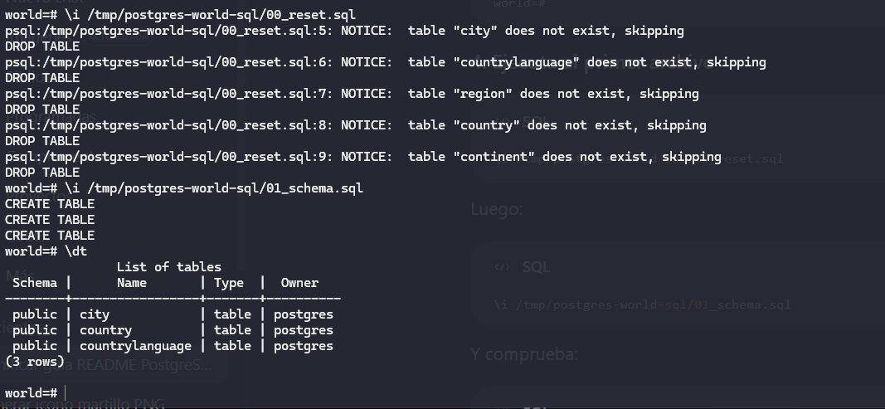
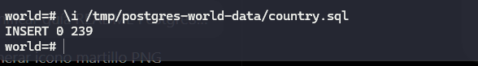
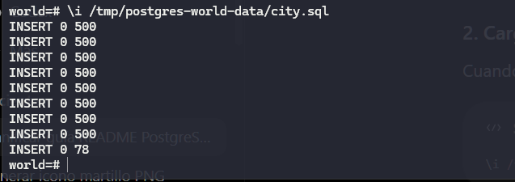
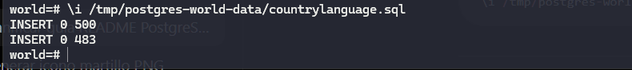
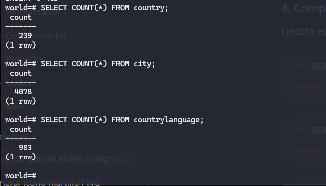
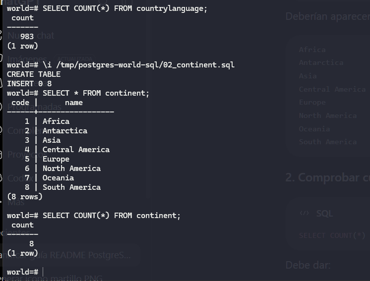
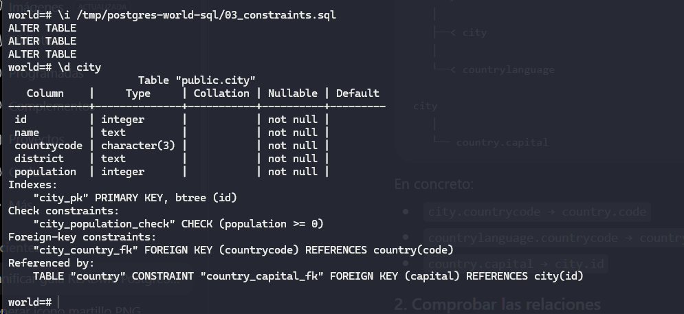
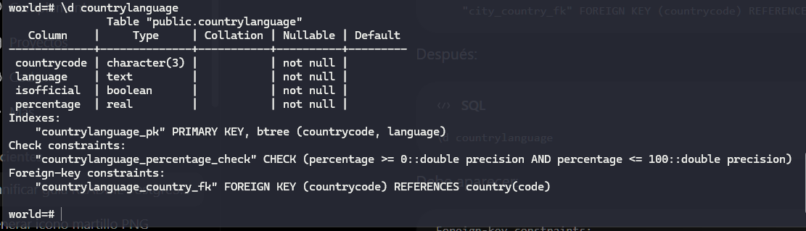
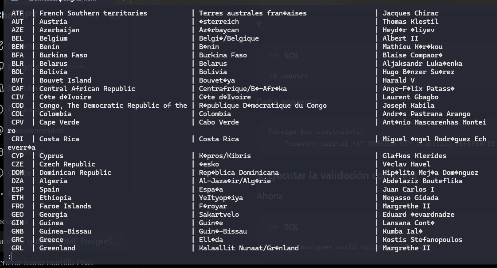

# PostgreSQL + Docker — Volcado de Datos y Modelado Relacional

**Autor:** Diego Mantilla

Este proyecto contiene la carga limpia de datos (`country`, `city` y `countrylanguage`), creación e inserción de `continent`, llaves foráneas/restricciones, validaciones de integridad y procedimientos para generar y restaurar volcados lógicos en PostgreSQL.

---

## 1. Estructura del Proyecto

```text
postgres-world/
├── README.md
├── world_backup.sql
├── data/
│   ├── city.sql
│   ├── country.sql
│   └── countrylanguage.sql
├── img/
│   ├── alter.png
│   ├── continents.png
│   ├── insertCity.png
│   ├── insertCountries.png
│   ├── insertCountryLanguage.png
│   ├── relationsCountry.png
│   ├── resetAndSchema.png
│   ├── verifyAll.png
│   └── verifySelects.png
├── original/
│   ├── city.sql
│   ├── country.sql
│   └── countrylanguage.sql
└── sql/
    ├── 00_reset.sql
    ├── 01_schema.sql
    ├── 02_continent.sql
    ├── 03_constraints.sql
    └── 04_verify.sql
```

- **`sql/`**: Scripts SQL organizados secuencialmente.
- **`data/`**: Datos limpios y listos para importar.
- **`original/`**: Copia de respaldo de archivos recibidos originalmente con problemas de codificación.
- **`img/`**: Evidencias completas en capturas de pantalla.
- **`world_backup.sql`**: Volcado lógico completo listo para restauración.

---

## 2. Errores Identificados en los Datos y Soluciones Aplicadas

Durante el análisis del dataset inicial (ubicado en `original/`), se detectaron 6 errores principales que impedían una importación limpia y consistente en PostgreSQL. A continuación se detallan las correcciones implementadas:

### 1. Corrupción de Caracteres Especiales (Codificación Bad Characters `U+FFFD` / ``)
- **Problema:** Los archivos de datos originales contenían caracteres de reemplazo `` debido a una mala conversión previa de codificación en nombres con acentos o caracteres especiales (ej: `'Jos Eduardo'`, `'Shqipria'`, `'Fernando de la Ra'`, `'sterreich'`, `'Azrbaycan'`, `'Curaao'`, `'Stif'`).
- **Solución:** Se sanearon los archivos en la carpeta `data/` eliminando y restaurando la codificación a UTF-8 limpia para garantizar la inserción de texto sin errores en PostgreSQL.

### 2. Ausencia de DDL (Falta de Sentencias `CREATE TABLE`)
- **Problema:** Los volcados planos recibidos contenían únicamente sentencias `INSERT INTO`, por lo que intentar ejecutarlos en una base de datos limpia generaba el error `ERROR: relation "public.country" does not exist`.
- **Solución:** Se creó el script `sql/01_schema.sql` declarando explícitamente el esquema DDL con los tipos de datos optimizados (`bpchar`, `text`, `int4`, `float4`, `numeric`, `bool`) y llaves primarias de `country`, `city` y `countrylanguage`.

### 3. Violación de Integridad Referencial durante la Inserción (Foreign Keys Prematuras)
- **Problema:** Existían dependencias circulares y cruzadas entre tablas (`city` y `countrylanguage` apuntan a `country.code`, mientras `country` apunta a `city.id` como `capital`). Definir las Foreign Keys antes de cargar los miles de datos bloqueaba las inserciones.
- **Solución:** Se desacopló la declaración de restricciones en `sql/03_constraints.sql`. Las llaves foráneas se aplican mediante `ALTER TABLE ... ADD CONSTRAINT` **después** de que todos los datos han sido volcados en las tablas.

### 4. Falta de Normalización en la Entidad `continent`
- **Problema:** Los continentes venían representados como texto repetitivo (`text`) dentro de `country`, violando principios de normalización relacional.
- **Solución:** Se creó la tabla `continent` en `sql/02_continent.sql` con una clave primaria autoincremental (`serial4`) y se extrajeron automáticamente los continentes únicos mediante `INSERT INTO continent (name) SELECT DISTINCT continent FROM country ORDER BY continent ASC;`.

### 5. Ausencia de Restricciones de Dominio y Rango (`CHECK`)
- **Problema:** No existían validaciones para impedir datos numéricos negativos o inconsistentes en la base de datos.
- **Solución:** Se incorporaron restricciones `CHECK` en el DDL (`population >= 0`, `surfacearea >= 0`, `percentage >= 0 AND percentage <= 100`, y valores específicos en la lista de continentes).

### 6. Ausencia de Mecanismos de Reinicio Idempotente y Verificación
- **Problema:** Si una ejecución fallaba, no había forma de reiniciar el proceso de manera limpia sin borrar manualmente las tablas en el orden correcto.
- **Solución:** Se incluyó `sql/00_reset.sql` para la eliminación segura de tablas (`DROP TABLE IF EXISTS ... CASCADE`) y `sql/04_verify.sql` para comprobar conteos de filas, ausencia de huérfanos y verificación de caracteres ``.

---

## 3. Preparación Inicial (Docker + Terminal)

### 1. Copiar archivos al contenedor Docker
Desde la terminal de tu sistema operativo:
```bash
docker cp . postgres_db:/tmp/postgres-world
```

### 2. Conectarse a PostgreSQL
```bash
docker exec -it postgres_db bash
psql -U postgres
```

---

## 4. Guía Paso a Paso (Ejecución SQL y Carga de Datos)

Ejecuta los siguientes comandos dentro de la consola de `psql` en orden secuencial:

### Paso 1: Limpieza y Creación del Esquema
Reinicia la base de datos e inicializa las tablas principales:
```sql
\i /tmp/postgres-world/sql/00_reset.sql
\i /tmp/postgres-world/sql/01_schema.sql
```

#### Evidencia de Esquema y Reset:


---

### Paso 2: Carga de Datos (Volcado de Inserción Masiva)
Carga la información limpia de países, ciudades e idiomas:

```sql
\i /tmp/postgres-world/data/country.sql
```
#### Evidencia de Inserción de Países (`country`):


```sql
\i /tmp/postgres-world/data/city.sql
```
#### Evidencia de Inserción de Ciudades (`city`):


```sql
\i /tmp/postgres-world/data/countrylanguage.sql
```
#### Evidencia de Inserción de Idiomas (`countrylanguage`):


#### Verificar conteo de registros:
```sql
SELECT COUNT(*) FROM country;
SELECT COUNT(*) FROM city;
SELECT COUNT(*) FROM countrylanguage;
```


---

### Paso 3: Normalización de Continentes
Crea la tabla `continent` e inserta los continentes únicos extraídos de `country`:
```sql
\i /tmp/postgres-world/sql/02_continent.sql
```
#### Evidencia de Creación e Inserción de Continentes:


---

### Paso 4: Llaves Foráneas y Restricciones
Establece las relaciones entre tablas e integridad referencial (`FOREIGN KEY`):
```sql
\i /tmp/postgres-world/sql/03_constraints.sql
```

#### Evidencia de Aplicación de Restricciones (ALTER TABLE):


#### Evidencia del Modelo de Relaciones entre Tablas:


---

### Paso 5: Verificación de Integridad
Comprueba que no existan huérfanos, capitales inválidas o datos inconsistentes:
```sql
\i /tmp/postgres-world/sql/04_verify.sql
```
#### Evidencia de Verificación Total:


---

## 5. Explicación del Proceso de Volcado y Restauración (`pg_dump`)

El volcado de datos en este proyecto se gestiona mediante dos estrategias complementarias:

1. **Volcado Físico Estructurado (Fase de Importación):** Los datos procesados en la carpeta `data/` permiten reconstruir la base de datos desde archivos de código fuente SQL desacoplados de llaves foráneas para maximizar la velocidad de inserción y evitar errores de integridad.
2. **Volcado Lógico Integral (`world_backup.sql`):** Generado mediante la herramienta nativa `pg_dump` de PostgreSQL. Este archivo consolida en una sola transacción la creación de objetos, secuencias, comandos `COPY` de alta eficiencia y la restitución automática de índices y llaves relacionales.

### Exportar Volcado Lógico Completo (`pg_dump`)
Desde la terminal del sistema operativo:
```bash
docker exec -t postgres_db pg_dump -U postgres postgres > world_backup.sql
```

### Restaurar Volcado Lógico Completo (`psql`)
Desde la terminal del sistema operativo:
```bash
docker exec -i postgres_db psql -U postgres -d postgres < world_backup.sql
```

